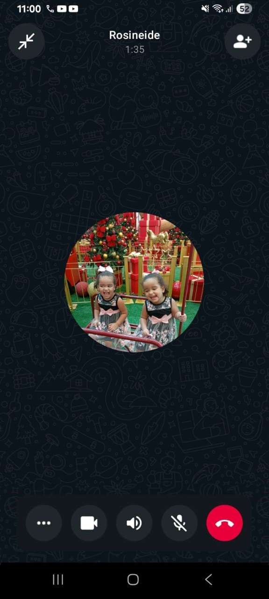

- Comprovação de reunião/apresentação: 

- Relatório da apresentação: Por meio de uma ligação pelo wpp, foi apresentado o intuito do sistema para a Rosineide. Depois disso, questionamos se ela aceitaria analisar o sistema e retornar com seu feedback e a resposta foi sim. Assim, foi enviado para ela o link do projeto hospedado na Vercel
